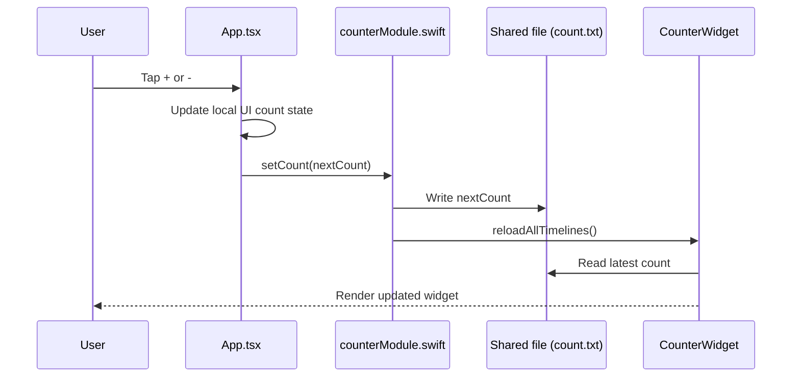

# widget-ios

Expo app with a local native module that syncs a counter value to an iOS Widget.

## What this project does

- Shows a counter on the app home screen.
- Lets you increment/decrement the counter in the app.
- Persists the value to an App Group shared file.
- Triggers `WidgetCenter.reloadAllTimelines()` so widgets refresh.
- Displays the counter on an iOS Home Screen widget (and lock screen variants supported by the widget target setup).

## Architecture

```mermaid
flowchart TD
  A[React Native App\nApp.tsx] -->|Counter.setCount(n)| B[Expo Native Module\nmodules/counter/ios/counterModule.swift]
  B --> C[App Group Shared Container\ncount.txt]
  B --> D[WidgetCenter.reloadAllTimelines()]
  C --> E[CounterWidget Extension\nios/CounterWidget/*]
  D --> E
  E --> F[Home Screen Widget]
  E --> G[Lock Screen Widget]
```

## Data flow (button tap -> widget update)



## Screenshots

| App Home Screen                                | Lock Screen Widget                                | Home Screen Widget                            |
| ---------------------------------------------- | ------------------------------------------------- | --------------------------------------------- |
|  |  |  |

## Key files

- `App.tsx`: app UI, counter state, increment/decrement actions, native sync.
- `modules/counter/src/counterModule.ts`: JS/TS bridge to native module.
- `modules/counter/ios/counterModule.swift`: writes count to shared storage and asks WidgetKit to refresh.
- `ios/CounterWidget/`: widget extension implementation.
- `modules/counter/expo-module.config.json`: native module registration metadata.

## Run locally

## Prerequisites

- Node.js / Bun installed
- Xcode installed (for iOS and widgets)
- CocoaPods available

## Install

```bash
bun install
```

## Start Expo

```bash
bun run start
```

## Run iOS app (required for local native module + widget)

```bash
bun run ios
```

If native dependencies or iOS project settings change:

```bash
cd ios && pod install
```

## Using the app

1. Launch the app.
2. Tap `+` to increment or `-` to decrement.
3. Decrement is clamped at `0` (cannot go negative).
4. App immediately updates UI count.
5. App syncs count to native module; widget refresh follows.

If native sync fails, the app shows `Sync failed. Please try again.`

## Widget setup notes

- The native module uses App Group container ID: `group.com.widgetios.counter`.
- Count is written to `count.txt` inside the App Group container.
- The widget extension must use the same App Group entitlement to read the value.

If widget values do not change:

- Verify app and widget targets share the same App Group.
- Rebuild app from Xcode/Expo run.
- Remove/re-add widget from the Home Screen.

## Troubleshooting

- Build errors after native changes:
  - Run `cd ios && pod install`.
  - Clean build folder in Xcode and rebuild.
- Widget not refreshing:
  - Confirm `WidgetCenter.reloadAllTimelines()` is called after `setCount`.
  - Confirm shared file path and entitlements match.
