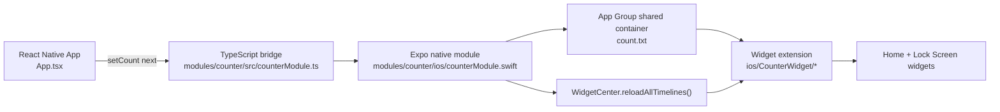
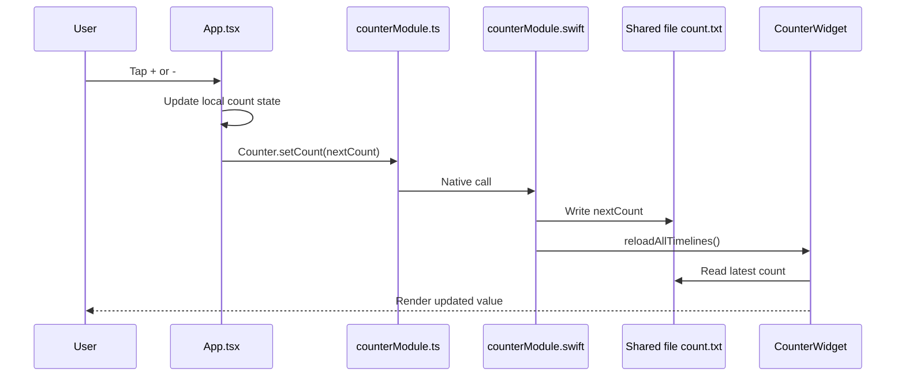
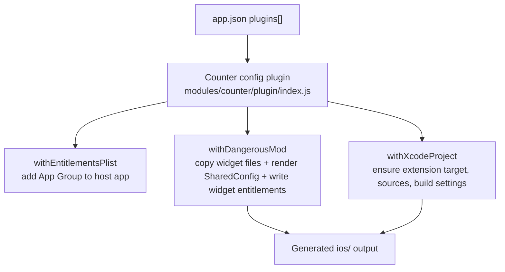
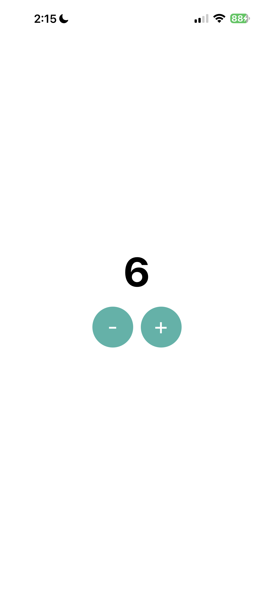
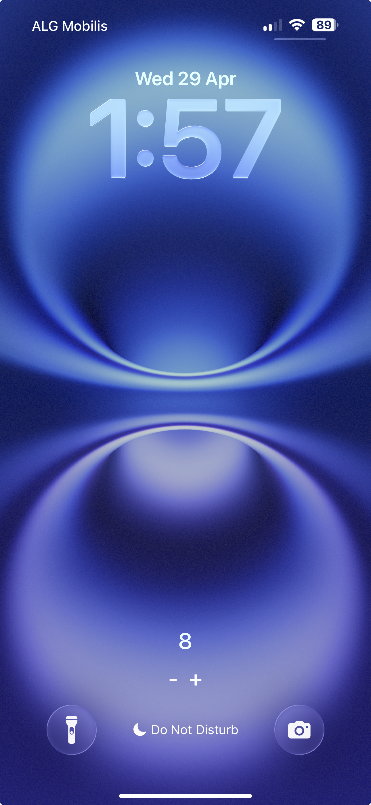
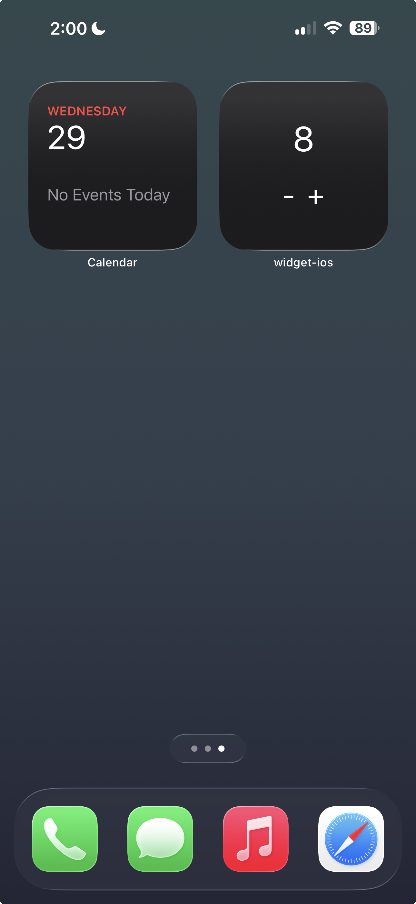

# widget-ios

Expo app that demonstrates an end-to-end iOS widget integration using:

- a local Expo native module (`modules/counter`)
- an Expo config plugin (`modules/counter/plugin`)
- App Group shared storage
- a generated widget extension target during prebuild

This repository is designed as a reference architecture for "React Native app + Expo module + iOS widget" workflows.

## What this app does

- Displays a counter in the React Native app.
- Increments/decrements the counter from the app UI.
- Persists the latest value to an App Group shared container file (`count.txt`).
- Triggers widget timeline reload via WidgetKit.
- Shows the same value inside a Home Screen and Lock Screen widget.

## High-level architecture



## Runtime data flow



## Prebuild and plugin architecture

The widget target is not treated as manual source inside `ios/`.

- Source of truth for widget files: `modules/counter/ios-widget`
- Generated output during prebuild: `ios/<widgetName>`
- Config plugin entry: `modules/counter/app.plugin.js`
- Plugin implementation: `modules/counter/plugin/index.js`



## Config plugin usage

Register the plugin in `app.json`:

```json
{
  "expo": {
    "plugins": [
      [
        "./modules/counter/app.plugin.js",
        {
          "appGroup": "group.com.widgetios.counter",
          "widgetName": "CounterWidget",
          "widgetBundleIdSuffix": "CounterWidgetExtension"
        }
      ]
    ]
  }
}
```

Plugin props:

- `appGroup`: shared App Group identifier used by app + widget.
- `widgetName`: folder/group name generated under `ios/`.
- `widgetBundleIdSuffix`: extension target/product suffix used to build extension bundle id and entitlements filename.

### What the plugin mutates

1. Host app entitlements

- Ensures `com.apple.security.application-groups` contains `appGroup`.

2. iOS filesystem

- Copies widget source files from `modules/counter/ios-widget/CounterWidget` to `ios/<widgetName>`.
- Copies widget `Info.plist` template.
- Generates `SharedConfig.swift` with the configured `appGroup`.
- Writes `<widgetBundleIdSuffix>.entitlements`.

3. Xcode project (`project.pbxproj`)

- Ensures extension target exists (`app_extension`).
- Ensures required build phases exist.
- Ensures widget source files belong to widget target sources.
- Applies extension build settings (Info.plist, bundle id, entitlements, Swift/deployment flags).

## Native module details

### JavaScript/TypeScript bridge

- `modules/counter/src/counterModule.ts` exposes the native module to React Native code.
- `modules/counter/index.ts` re-exports module/view/types.

### iOS native implementation

- `modules/counter/ios/counterModule.swift` is the core write path.
- It writes the counter value into the shared App Group container (`count.txt`).
- It triggers `WidgetCenter.reloadAllTimelines()` so the widget picks up updates.

## iOS widget extension details

Canonical widget source is kept in:

- `modules/counter/ios-widget/CounterWidget`

During prebuild, files are generated into:

- `ios/CounterWidget` (or custom `widgetName`)

Important files:

- `CounterWidget.swift`: widget timeline/provider and UI.
- `CounterIntent.swift`, `AppIntent.swift`: intent/action integration.
- `CounterWidgetBundle.swift`: extension bundle entry.
- `SharedConfig.swift`: generated app-group configuration.
- `Info.plist`: extension metadata template.

## Source-of-truth vs generated files

- Edit widget implementation in `modules/counter/ios-widget/*`.
- Do not treat `ios/CounterWidget/*` as long-term source-of-truth.
- Regenerate native output with prebuild when plugin/template changes happen.

## Key project files

- `App.tsx`: app UI and state transitions.
- `app.json`: plugin registration and plugin inputs.
- `modules/counter/plugin/index.js`: config plugin logic.
- `modules/counter/expo-module.config.json`: Expo module registration metadata.
- `modules/counter/src/counterModule.ts`: JS bridge.
- `modules/counter/ios/counterModule.swift`: iOS native module logic.
- `modules/counter/ios-widget/README.md`: widget source-of-truth note.

## Run locally

### Prerequisites

- Bun or Node.js available.
- Xcode installed.
- CocoaPods available for iOS dependencies.

### Install dependencies

```bash
bun install
```

### Generate native iOS project

```bash
npx expo prebuild --clean --platform ios
```

### Run app on iOS

```bash
npx expo run:ios
```

## How to use the app

1. Launch the app on iOS.
2. Tap `+` / `-` to change the counter.
3. App updates local state immediately.
4. Native module writes value to shared container and triggers widget reload.
5. Widget displays the latest value after timeline refresh.

## Verification checklist

- App and widget targets share the same App Group entitlement.
- `ios/<widgetName>/SharedConfig.swift` contains the expected `appGroup`.
- `<widgetBundleIdSuffix>.entitlements` exists under `ios/` and matches App Group.
- Widget files are included in extension target Sources build phase.
- Extension build settings point to `<widgetName>/Info.plist`.

## Troubleshooting

### Widget value does not refresh

- Confirm native call reaches `setCount` path.
- Confirm `WidgetCenter.reloadAllTimelines()` is executed.
- Confirm app and widget entitlements use the same `appGroup`.
- Remove/re-add widget from Home Screen.

### Wrong value in widget

- Verify shared file path and App Group identifier match between:
  - `modules/counter/ios/counterModule.swift`
  - generated `ios/<widgetName>/SharedConfig.swift`

## Screenshots

| App Home Screen                                | Lock Screen Widget                                | Home Screen Widget                            |
| ---------------------------------------------- | ------------------------------------------------- | --------------------------------------------- |
|  |  |  |
